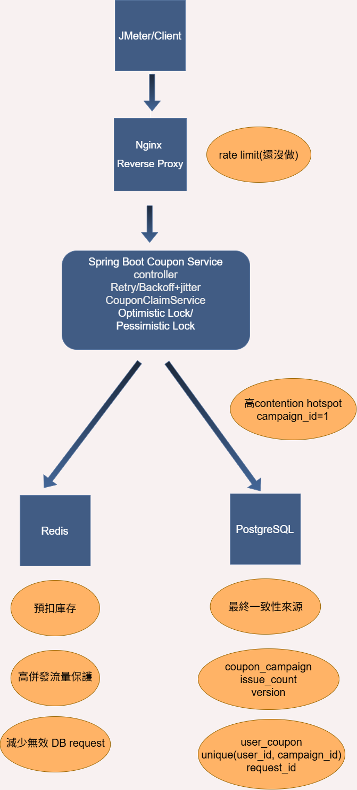

# Coupon Demo (Spring Boot)

一個簡單的優惠券領取系統，用來模擬高併發場景下的發券邏輯。

# System Architecture


---

## 🚀 Tech Stack

- Java 21
- Spring Boot
- Spring Data JPA
- PostgreSQL
- Maven

---

## 📌 Features

- 領取優惠券 API
- 防重複請求（requestId）
- 防止同一用戶重複領取
- 庫存限制（total_limit）
- 狀態檢查（ACTIVE / SOLD_OUT）

## 📂 Project Structure

controller → API入口
service → 核心邏輯
repository → DB操作
entity → 資料表映射
dto → request / response

## 🔗 API

### Claim Coupon

POST `/api/v1/coupon/{campaignId}/claim`

### Request Body

```json
{
  "userId": 1001,
  "requestId": "req-001"
}

### Response
{
  "result": "SUCCESS"
}


Database

coupon_campaign
    id
    code
    total_limit
    issue_count
    status
    version
    create_at

coupon_campaign
    id
    code
    total_limit
    issue_count
    status
    version
    create_at

已完成功能
PostgreSQL 持久化
防重複請求（requestId）
防重複領取（campaignId + userId）
JPA 樂觀鎖
retry（最多 3 次）
Redis 庫存閘門
Redis Lua 原子扣減

流程概述
先透過 Redis Lua script (保證其原子性) 判斷是否還有庫存，只有 stock > 0 才扣減
扣減成功後才進入 DB 流程
DB 端再檢查重複請求 / 重複領取 / 活動狀態
使用樂觀鎖避免多個請求同時成功更新同一筆活動資料
若 DB 最終失敗，補回 Redis 庫存

增加不同retry的thread.sleep時間的併發導致失敗實驗比較(詳細說明都在word,實驗數據都在excel)
實驗結論為用Thread.sleep(retryTime*50L)會比baseDelay + retryTime * stepDelay + jitter的併發數多約40%，且在併發樣本高才顯現，而jitter方式的latency可能高於純粹線性的thread.sleep，但亦可能為jitter本身的baseDelay和stepDelay設定變數就比thread.sleep()高導致，故可透過針對不同Request預期數量適當調整參數降低latency。

樂觀鎖_測試不同量級請求的效能比較(詳細說明都在word,實驗數據都在excel)
實驗結論為在不同的量級請求下的conflict的比例平均都在6%~7%，Redis阻擋超發流量的平均值大約分布在92~98%，會有92%這種較低的原因的特徵都有出現Error rate不為0的情況，而在result.jtl(JMeter原始資料)出現HttpHostConnectException: Connection refused，狀態碼為NOT_FOUND，推測可能原因有三個，第一個原因為Spring boot在測試中直接崩潰，第二個原因為Tomcat thread(我用預設值200)、DB connection pool 承受不了瞬間連線，第三個原因為JMeter 2000 threads 瞬間打 localhost，超過本機可承受能力。

由此衍生後續研究
1.不同Rame-up情況下的服務連接情況
2.不同backoff+jitter參數的latency、conflict比較
3.悲觀鎖和樂觀鎖的latency和success比較

不同Rame-up情況下的服務連接情況(詳細說明都在word,實驗數據都在excel)
實驗結論為越高的request會導致Error-rate更高，而在相同request不同Ramp-up的層面，request2000是符合越高Ramp-up可以降低Error-rate的推論，但request4000則在0.5秒和1秒的部分沒有符合這個推論，推測可能是因為request數量過高，導致對於Tomcat或Thread pool都無法承受，不論是0.5秒或1秒的Ramp-up都相差無幾。


不同backoff+jitter參數的latency、conflict比較(詳細說明都在word,實驗數據都在excel)
實驗結論為backoff+jitter的conflict/request比例為3.2%，exponential backoff的conflict/request的比例為5.4%，exponential backoff+jitter的conflict/request的比例為0.2%，且exponential backoff+jitter不只是碰撞少，他的latency平均中位數和PR99也都是三個當中最低的，我認為原因是因為這個方法擁有的jitter的空間理論上最大，可以最大程度避免碰撞，並且減少耗時。


樂觀鎖vs悲觀鎖_latency和success比較(詳細說明都在word,實驗數據都在excel)
實驗結論


隔離層級比較和理解(詳細說明都在word)


悲觀鎖timeout-deadlock實驗


測試方式
Docker 啟動 Redis
JMeter 併發請求

已知限制
retry 與 transaction 結構仍可再重構
結果碼仍是字串，後續可改 enum
尚未做完整監控與指標統計


